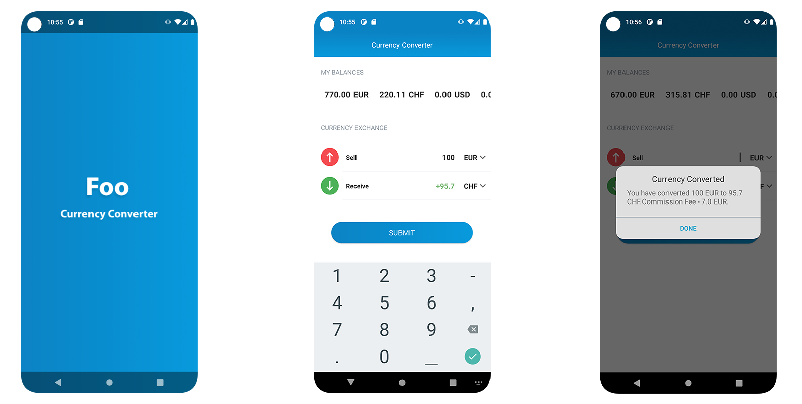

## Foo ##
Currency Exchanger Sample

## brief description ##

base structure is clean architecture with MVVM design pattern with jetpack components.   
**Kotlin Dsl**: Better dependency management using buildSrc + Kotlin DSL.  
**MVVM** 
**Retrofit** 
**Coroutines** 
**Room** 
  

# screenshots #

